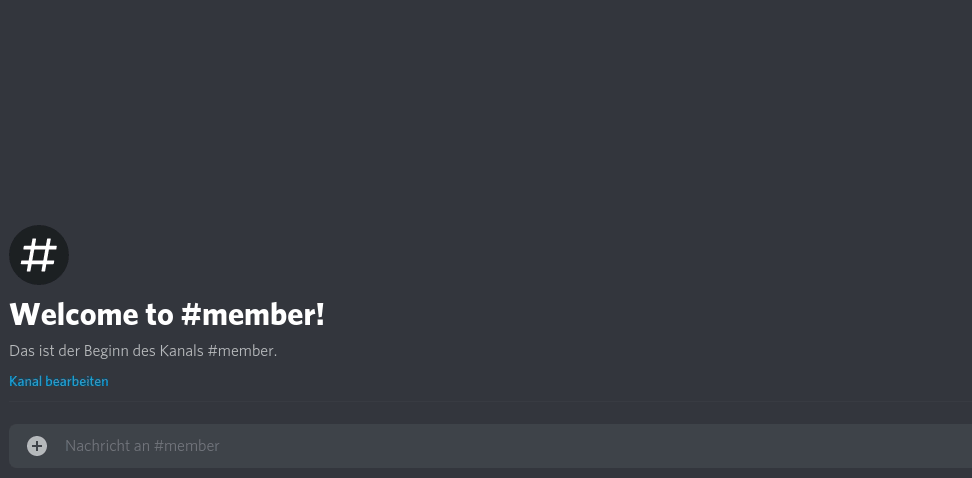

# EnqueueMe - A discord queue bot
[](https://coveralls.io/github/ExLeonem/enqueueMe?branch=master)
[](https://travis-ci.org/ExLeonem/enqueueMe)
[](http://inch-ci.org/github/ExLeonem/enqueueMe)


EnqueueMe is a discord bot that can be used to manage a queue. Server members are able to enqueue by typing */qme*, leave the queue by typing */cancel*. An enqueued member is able to check how many people are before him in the queue. Server members with a specific role are able to select members from the queue. The queue is persisted in a file. The communication with the bot can be limited to specific channels/categories by using a config.json file.


# Example




# Index

1. [Setup](#Setup)
2. [Deployment](#Deployment)
3. [Roadmap](#Roadmap)
4. [Commands](#Commands)
    1. [Enqueue](#Endqueue)
    2. [Dequeue](#Dequeue)
    3. [List](#List)
    4. [Listen](#Listen)
    5. [Peek](#Peek)
    6. [Configure](#Configure)
5. [Documentation](#Documentation)
    1. [Creating commands](#Creating-commands)
    2. [Using the storage](#Storage)


## Setup

Setup up a bot in the discord.js console, following the official guide.


Put a configuration file into the project root named `config.json` with following content:

```json
    {
        "prefix": "a prefix to use like '/'",
        "token": "the bot token",
        "adminRole": "the admin role to allow query queue information from the bot",
        "channels": {
            "category": "the default category anme under which the channels are listed, no category to allow communication on every channel.",
            "member": "the default member channel name",
            "admin": "the default admin channel name"
        }
    }
```

There are different possibilities to configure the channels to be used for communication with the bot. Here are a few.

```json
    "category": "bot",
    "member": ["member", "test", "something else"],
    "admin": "admin"
```

## Ideas

- [ ] Adding [string similiary algorithm](https://itnext.io/string-similarity-the-basic-know-your-algorithms-guide-3de3d7346227) for suggestion of commands 
- [ ] Allow for random response selection
- [ ] Re-enter limit (Limit the time until a user is able to enqueue again to prefent spam)
- [ ] Additional commands that could be interesting
    - [ ] empty -> empty the complete queue
    - [ ] /config limit <number> -> limit the amount of people that can be queued
- [ ]  Select a response randomly from a number of responses or generate response text via language model.
- [ ] Fork: Discord bot starter with script to create command stubs?

## TODO
    
- [ ] Check responses if under configured category but not on the right channel, bot seems to return the wrong respnose
- [ ] Ouput error message if config file non-existent
- [ ] Use documentation badge on master branch
- [ ] use embed message for help


## Commands

Added | Command | Parameters | Effect
| --- | --- |--- | ---
| <ul><li> [x] </ul></li>| /qme | - | Enqueues the user calling
| <ul><li> [x] </ul></li>| /cancel | - | Remove the calling user from the queue
| <ul><li> [x] </ul></li>| /next | - | Dequeues the next user from a queue. Only callable by members who'm are given appropriate role (configured in `./config.json` as adminRole)
| <ul><li> [x] </ul></li> | /putback | - | Puts a user back into the queue
| <ul><li> [x] </ul></li> | /list | -  | Returns the position of the user in the queue
| <ul><li> [x] </ul></li> | /listen | - \| stop | If a user enqueues the user who called this command will be informed
| <ul><li> [x] </ul></li> | /peek | - \| <number> \| all | Peeks into the queue for x-positions from the head of the queue.
| <ul><li> [x] </ul></li> | /help | - | Prints a help for the bot commands
| <ul><li> [ ] </ul></li> | /config | - | configuration of guild specifics


### Configuration
You can use the */config* command to configure ...
- the channels which are useable by the bot
- the max queue length

| argurments | description
| ---   | ---
| channel show <member\|admin> |  Shows the currently configured channels for communication with this bot
| channel add <member\|admin> <channelName> <categoryName> | Add a channel over which users can communicate with the bot. The category name is optional.
| channel rm <member\|admin> <channelName> <categoryName> | 
| queue <number> | Set the maximum queue size to the given number. The given number must be > 0
| admin <roleName> | Set a privileged user role which can configure the bot.


## Documentation


### Creating commands

To define new commands you need to create a new file in the `/commands` directory for each command. You can define a command by subclassing from the Command class located in`./core/command.js`. The constructor takes in the storage object and the file-name as parameteres on initialization. The fileName represents the command name and defaults to the name of the file, without the file extension (.js). Overwriting the command name, setting command specific options and response messages can be done inside the `./commands/defintions.json`. For more information you can check below.

You can use the following boilerplate to define a new command.


```js

const Command = require('../core/command');

class CommandName extends Command {

    constructor(storage, fileName) {
        super(fileName); 
        this.storage = storage;
    }


    /**
     * 
     * @param {Object} message - The deafult discord message object encapsulating the user request
     * @param {String[]} args - Additional arguments passed with a message call as an array.
     * 
     */
    execute(message, args) {

        // Command specific code here

        // To get responses defined in ./definitions.json call (inherited from ./core/command.js)
        let responseMessage = this.getReponse("responseKey", param1, param2, ...)

        // You can return a message like this. Check the discord.js documentation for more information 'message.reply("")' for private messages 
        return message.channel.send("Hello World."); 
    }
}

module.exports = CommandName;
```

The `bot.js` script pulls all files from `./commands` that end with .js, loading the commands automatically. After defining the command you need to extend the 
You can modify the name used for the command by creating a new entry in the `./commands/definitions.json` file, the name overwrites 


Right below you see an example entry for an imaginary command defined in `./commands/example.js`.
```js

{
    "example": { // The name of the file
        "name": "ping", // The name of the command by which it can be called inside of discord
        "asAdmin": false, // Only useable by bot admins
        "responses": {
            "success": "<@{0}>, pong!",
            "error": "<@{0}, I couldn't fullfill your request, Try to contact <@{1}>."
        }
    }
}

```


### Storage

A storage object is passed to the constructor of each command. The API for storage use is defined in `./core/storage.js`.
There are mainly two methods you can use, `set` to set a specific value or `get` to get a value stored under a key.


#### set(key, value)
Set a value for the given key. The key is a string, describing a path for navigating the json objects. Each key segement represents a single key. However the path segments must have at least 2-Segments. The first one is the file in which the data will be stored, the second one is the first key the value will be stored under.

| Parameter | Type | Description | Example
| --- | --- | --- | ---
| key | String | The key under which the value is stored. Key segements separated by dots. | queue.count
| value | * | The value to be stored under given key | 123, "Some String", [1, 2, 34]


#### get(key)
Retrieve a value for the given key if it exists, else return null.

| Parameter | Type | Description | Example
| --- | --- | --- | ---
| Key  | String | The key to get the value from | queue.member 
